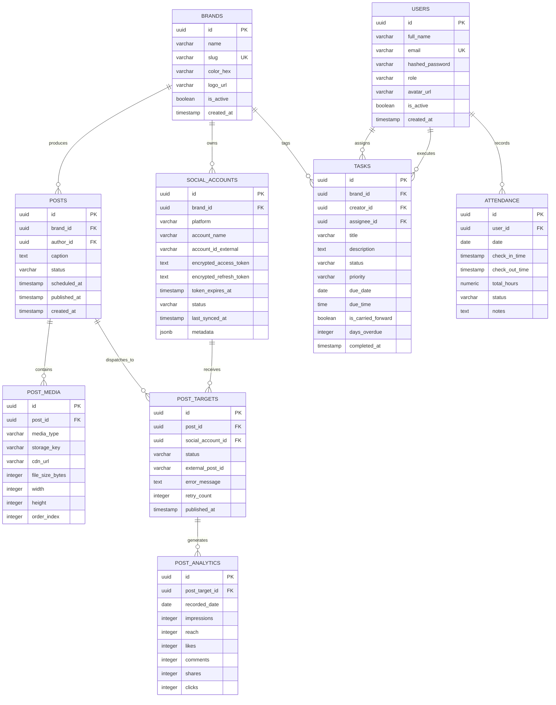
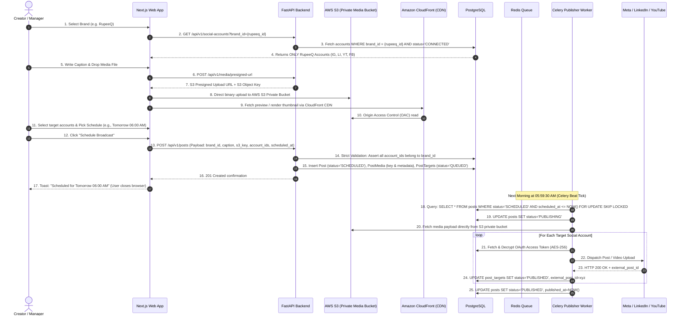
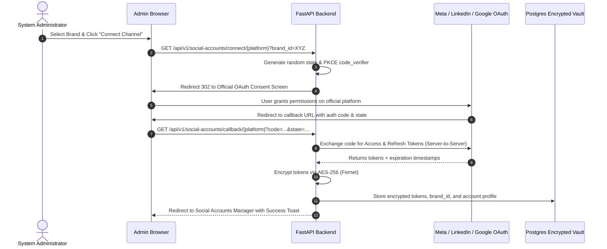

# SocialOS — Production Architecture & Engineering Design Document

> **System Title:** SocialOS (Enterprise Social Media Command Center & Team Operations System)  
> **Document Status:** APPROVED FOR PRODUCTION SCAFFOLDING  
> **Target Production Standard:** Enterprise Multi-Brand SaaS / Internal Operating System  
> **Reference Inputs:** `social-crm.html`, `docs/PROTOTYPE_SPECIFICATION.md`

---

## 1. Architecture Overview

### Selected Technology Stack: Option B (Decoupled Enterprise Architecture)

After extensive evaluation of the two proposed architectures:
* **Option A:** Full-Stack Next.js (Node.js/Prisma/Drizzle/BullMQ)
* **Option B:** Decoupled Architecture: Next.js 15 (Frontend) + Python FastAPI (Backend API & Async Engine) + PostgreSQL + SQLAlchemy/Alembic + Redis + Celery / Celery Beat

**Decision: Option B is selected as the primary production architecture.**

```
+---------------------------------------------------------------------------------------------------------+
|                                        FINAL TECHNOLOGY STACK                                           |
+----------------------+-----------------------------------------+----------------------------------------+
| Layer                | Technology Selected                     | Core Version / Specification           |
+----------------------+-----------------------------------------+----------------------------------------+
| Frontend Web Client  | Next.js (App Router), React, TypeScript | Next.js 15.x, React 19, TypeScript 5.x |
| Styling & UI Engine  | Tailwind CSS, Radix UI Primitives, Lucide| Dark-First Enterprise Design System    |
| Backend API Engine   | Python FastAPI (Async ASGI), Pydantic v2| Python 3.12+, FastAPI 0.115+, Uvicorn   |
| Database ORM & Migr. | PostgreSQL 16+, SQLAlchemy 2.0 (Async), | AsyncPG driver, Alembic Migrations     |
| Caching & Messaging  | Redis 7.2+                              | Redis Streams / In-Memory Cache        |
| Task Queue & Workers | Celery 5.4+ with Celery Beat Scheduler | Redis broker + PostgreSQL Result Bcknd |
| Media Storage        | AWS S3 (Private Media Bucket)           | Direct Presigned PUTs, Lifecycle Rules |
| CDN / Media Delivery | Amazon CloudFront                       | Origin Access Control (OAC), Global Edge|
| Authentication / JWT | OAuth 2.0 Authorization Code + PKCE     | RS256 JWT, Argon2id, Fernet (AES-256)  |
| Containerization     | Docker, Docker Compose, Multi-Stage OCI | Linux Alpine / Debian Slim base        |
+----------------------+-----------------------------------------+----------------------------------------+
```

### Why Option B is Superior for SocialOS

1. **Heavyweight Media & Social Graph API Operations:**  
   Social publishing involves multi-megabyte media ingestion, image resizing to platform-specific aspect ratios (1:1, 4:5, 9:16, 16:9), video chunking/transcoding checks, and multi-step resumable uploads (e.g., Meta Graph API 3-phase video upload container creation, check status, dispatch; YouTube Data API v3 multipart upload). Node.js event loops can easily encounter memory pressure or CPU blocking when handling concurrent streaming binary media. Python has battle-tested, low-level binary and media handling (`Pillow`, `ffmpeg-python`, `httpx` async streams).

2. **Distributed Scheduled Publishing Reliability (Celery + Celery Beat):**  
   Celery Beat paired with Redis provides an industrial-grade scheduler that decouples scheduling state from browser sessions. BullMQ (in Node.js) is effective, but Celery's task routing, rate-limiting per social domain (e.g., maximum 5 requests per second per Meta app client), automated exponential backoff retries with jitter, and dead-letter queues (DLQ) are the gold standard for high-reliability background dispatching.

3. **Battle-Tested Social SDKs & Cryptography:**  
   Python's cryptographic libraries (`cryptography.fernet`, `hashlib`, `hmac`) provide zero-compromise encryption-at-rest for OAuth access and refresh tokens. Official or standard Python clients (`google-api-python-client`, `facebook-sdk`, `requests-oauthlib`) have extensive production lineage handling complex OAuth 2.0 edge cases (e.g., token refreshing during flight, scopes degradation, webhook signature verification).

4. **Strict Separation of Concerns:**  
   Next.js is utilized where it excels: server-side rendering, ultra-responsive UI component hydration, optimistic UI updates, client-side route caching, and zero-latency UX. FastAPI is utilized where it excels: lightning-fast async request validation via Pydantic v2, granular dependency injection for database sessions and RBAC security gates, and deterministic serialization.

---

## 2. High-Level Architecture Diagram

```mermaid
graph TD
    subgraph Client_Layer ["Client Layer (Browser)"]
        User["User / Manager / Creator"]
        Browser["Modern Web Browser (Chrome, Safari, Edge)"]
        User -->|Interacts via HTTPS| Browser
    end

    subgraph Frontend_App ["Frontend Layer (Next.js 15 App Router)"]
        NextServer["Next.js Node.js Server (SSR / App Shell)"]
        ReactClient["React Client Components (Zustand / TanStack Query)"]
        Browser -->|Page Request| NextServer
        Browser -->|Client Hydration / SPA Navigation| ReactClient
    end

    subgraph Gateway_Security ["Security & Routing"]
        Nginx["Reverse Proxy / TLS Termination (Nginx / Cloudflare)"]
        NextServer --> Nginx
        ReactClient -->|REST API Calls (Bearer JWT)| Nginx
    end

    subgraph Backend_Core ["Backend API Core (FastAPI Async)"]
        API["FastAPI Application (Uvicorn ASGI Workers)"]
        AuthMiddleware["JWT & RBAC Middleware"]
        RouterLayer["API Routers (/api/v1/*)"]
        ServiceLayer["Domain Services (PostService, TaskService, etc.)"]
        RepoLayer["Async Repositories (SQLAlchemy 2.0 Async)"]
        
        Nginx --> API
        API --> AuthMiddleware
        AuthMiddleware --> RouterLayer
        RouterLayer --> ServiceLayer
        ServiceLayer --> RepoLayer
    end

    subgraph State_And_Storage ["Persistence & Storage Infrastructure"]
        Postgres[("PostgreSQL 16 Primary DB\n(Normalized Tables, Encrypted Vault)")]
        RedisCache[("Redis 7.2 Cache & Broker\n(Session, Token Cache, Rate Limits)")]
        S3Bucket[("AWS S3 (Private Media Bucket)\n(MinIO for local dev)")]
        CloudFrontCDN["Amazon CloudFront (CDN)\n(Secure Media Delivery / OAC)"]
        
        RepoLayer -->|asyncpg connection pool| Postgres
        ServiceLayer -->|redis-py async| RedisCache
        ServiceLayer -->|Generate Presigned PUT URLs| S3Bucket
        CloudFrontCDN -->|Origin Access Control (OAC)| S3Bucket
        Browser -->|Direct Presigned PUT Upload| S3Bucket
        Browser -->|Fetch Media via CDN| CloudFrontCDN
    end

    subgraph Background_Workers ["Asynchronous Worker Fleet (Celery)"]
        CeleryBeat["Celery Beat (Periodic Cron & Heartbeat)"]
        CeleryWorker["Celery Worker Fleet (Publisher, Analytics, LMS)"]
        DLQ["Dead-Letter Queue (Failed Jobs & Alerts)"]

        CeleryBeat -->|Enqueue scheduled runs| RedisCache
        RedisCache -->|Distribute tasks| CeleryWorker
        CeleryWorker -->|Read / Update Post Status| Postgres
        CeleryWorker -->|Fetch Media Payload| S3Bucket
        CeleryWorker -->|Log fatal failures| DLQ
    end

    subgraph External_Social_APIs ["External Social Platform Graph APIs"]
        MetaGraph["Meta Graph API\n(Instagram & Facebook Pages)"]
        LinkedInAPI["LinkedIn Community API\n(Pages & Member Profiles)"]
        YouTubeData["Google YouTube Data API v3\n(Channels & Shorts)"]

        CeleryWorker -->|OAuth 2.0 / HTTPS Post| MetaGraph
        CeleryWorker -->|OAuth 2.0 / HTTPS Post| LinkedInAPI
        CeleryWorker -->|OAuth 2.0 / Resumable Upload| YouTubeData
    end
```

---

## 3. Frontend Architecture

### 3.1 Framework & App Structure
- **Framework:** Next.js 15 (App Router) with TypeScript 5.x.
- **Rendering Strategy:** Hybrid SSR for initial dashboard scaffolding and metadata; React Client Components for dynamic workspaces (Composer, Kanban, Analytics, Team Management).
- **Directory Layout:**
  ```
  frontend/
  ├── src/
  │   ├── app/
  │   │   ├── (auth)/
  │   │   │   ├── login/page.tsx
  │   │   │   └── layout.tsx
  │   │   ├── (dashboard)/
  │   │   │   ├── layout.tsx             # Global Sidebar, Topbar, Global Modals
  │   │   │   ├── page.tsx               # Main Command Center Dashboard
  │   │   │   ├── broadcast/page.tsx     # New Post Composer
  │   │   │   ├── pipeline/page.tsx      # Kanban Content Pipeline
  │   │   │   ├── analytics/page.tsx     # Metrics & Daily Summary
  │   │   │   ├── team/
  │   │   │   │   ├── page.tsx           # Manager Team Overview & Attendance
  │   │   │   │   └── my-work/page.tsx   # Employee Focused Task View
  │   │   │   └── settings/
  │   │   │       ├── brands/page.tsx
  │   │   │       └── accounts/page.tsx  # OAuth Account Manager
  │   ├── components/
  │   │   ├── ui/                        # Radix UI primitives (Button, Dialog, Dropdown, Toast)
  │   │   ├── layout/                    # Sidebar, BrandPillSelector, Topbar
  │   │   ├── composer/                  # ComposerBox, ChannelSelector, MediaDropzone, LivePreview
  │   │   ├── pipeline/                  # KanbanBoard, KanbanColumn, KanbanCard
  │   │   ├── team/                      # TaskTable, AttendancePunch, TaskDrawer
  │   │   └── analytics/                 # MetricCards, PerformanceBars, VolumeChart
  │   ├── stores/                        # Zustand stores (useBrandStore, useAuthStore)
  │   ├── hooks/                         # Custom React Query hooks (usePosts, useTasks)
  │   ├── lib/                           # Axios/Fetch API client, token storage, formatters
  │   └── types/                         # TypeScript DTO interfaces
  ```

### 3.2 State Management & Data Fetching
- **Server State:** `@tanstack/react-query` (TanStack Query v5) manages remote API cache, deduplication, background re-fetching, and optimistic updates.
- **Client UI State:** `zustand` manages lightweight global state:
  - `activeBrandId`: Currently selected brand (persisted in `localStorage` and synced with URL query params).
  - `composerDraft`: Active caption draft and media attachment state.
  - `authSession`: User details and permission keys.
- **API Client:** Type-safe HTTP client with interceptors for automatic JWT attachment, Bearer token injection, and 401 token refresh retry loops.

### 3.3 Component Architecture & UX States
- **Design Tokens:** Strict dark palette matching the prototype’s visual soul (`#090B0E` canvas, `#0E1217` surfaces, `#141922` cards, `#212836` borders).
- **Error & Loading Boundaries:**
  - Skeleton screens for all dashboard cards, Kanban columns, and task tables.
  - Error boundaries with explicit retry buttons.
  - Contextual empty states with clear calls-to-action (e.g., "No accounts connected for RupeeQ — [Connect Instagram]").
  - Sonner toast notifications for asynchronous actions (save, schedule, publish, task update).

---

## 4. Backend Architecture

### 4.1 Architecture & Layered Design Pattern
FastAPI is structured using an enterprise **Layered Domain-Driven Pattern**:

```
backend/
├── app/
│   ├── api/
│   │   └── v1/
│   │       ├── api_router.py            # Aggregator router
│   │       ├── endpoints/
│   │       │   ├── auth.py              # Login, token refresh, current user
│   │       │   ├── brands.py            # Multi-brand CRUD & isolation
│   │       │   ├── social_accounts.py   # OAuth initiation, callbacks, health
│   │       │   ├── posts.py             # Composer, drafts, scheduling, manual publish
│   │       │   ├── media.py             # Presigned upload URLs & verification
│   │       │   ├── tasks.py             # Team LMS tasks, state transitions
│   │       │   ├── attendance.py        # Punch in/out, daily ledger
│   │       │   └── analytics.py         # Rollups, daily briefing data
│   ├── core/
│   │   ├── config.py                    # Pydantic Settings (env parsing)
│   │   ├── security.py                  # Password hashing (Argon2), JWT encoding/decoding
│   │   ├── encryption.py                # Fernet AES-256 vault for OAuth tokens
│   │   ├── database.py                  # Async SQLAlchemy engine & session maker
│   │   └── redis.py                     # Redis client instance
│   ├── models/                          # SQLAlchemy ORM declarative models
│   ├── schemas/                         # Pydantic v2 validation DTOs (Request / Response)
│   ├── services/                        # Core business logic layer
│   │   ├── post_service.py              # Publishing workflow & brand isolation logic
│   │   ├── task_service.py              # Task lifecycle state machine & carry-forward
│   │   ├── attendance_service.py        # Shift duration & daily attendance ledger
│   │   └── oauth_service.py             # OAuth handshake & token exchange
│   ├── repositories/                    # Data access layer (pure SQL/ORM abstraction)
│   ├── workers/                         # Celery app & tasks
│   │   ├── celery_app.py                # Celery configuration
│   │   ├── tasks_publisher.py           # Scheduled post executor
│   │   ├── tasks_analytics.py           # Social API metric harvester
│   │   └── tasks_maintenance.py         # Daily carry-forward cron & token expiry check
│   └── main.py                          # ASGI application bootstrap
```

### 4.2 Security, RBAC & Middleware Stack
- **Authentication:** `HTTPBearer` extraction validating RS256 / HS256 JWT tokens.
- **Authorization Guard:** FastAPI dependency `require_permission("posts:publish")` verifying role privileges.
- **Audit Middleware:** Interceptor logging user ID, method, path, IP, and execution latency for all state-changing endpoints (`POST`, `PUT`, `DELETE`).
- **Structured Error Handling:** Global exception handlers returning RFC 7807 compliant problem details (`{"error_code": "INVALID_BRAND_CHANNEL", "message": "Channel does not belong to brand"}`).

---

## 5. Database Architecture & Schema

PostgreSQL 16 serves as the primary relational persistence layer with normalized schemas, foreign keys, and indexes.



### Critical Database Constraints & Brand Isolation Enforcement
1. **Brand Channel Isolation Strategy:**
   Brand channel isolation ensures that a post belonging to Brand A can never be dispatched to social accounts owned by Brand B. In production PostgreSQL, subqueries inside table `CHECK` constraints (e.g. `CHECK (EXISTS (...))`) are not supported by the database engine. Therefore, brand isolation is enforced across three defensive tiers:
   - **Relational Integrity Constraints:** Enforced using proper relational database constraints, including a composite foreign-key strategy where appropriate (such as propagating `brand_id` to `post_targets` and establishing composite foreign keys `(post_id, brand_id)` referencing `posts(id, brand_id)` and `(social_account_id, brand_id)` referencing `social_accounts(id, brand_id)`).
   - **Backend Validation & Authorization:** Domain service guards in `PostService` strictly validate that all destination `social_account_id` records belong exclusively to the post's owning `brand_id` prior to persistence.
   - **Transactional Integrity Checks:** Post creation and publishing workflows execute within atomic database transactions that verify cross-brand tenant boundaries before committing records.
2. **Attendance Uniqueness:** `UNIQUE (user_id, date)` ensures only one attendance master record exists per employee per calendar date.
3. **Idempotency Key on Posts:** `UNIQUE (idempotency_key)` prevents double submission from frontend retry clicks.

---

## 6. Social Publishing Architecture

### Detailed Publishing Lifecycle



---

## 7. Background Job Architecture

### 7.1 Distributed Task Queues
SocialOS maintains four isolated Redis queues:
1. `publish_queue`: High-priority queue reserved exclusively for scheduled and immediate post dispatching.
2. `analytics_queue`: Medium-priority queue for periodic metric harvesting (hourly/daily).
3. `maintenance_queue`: Low-priority queue for nightly tasks (task carry-forward, attendance auto-close, token health check).
4. `dead_letter_queue`: Captures tasks that exhausted all retry attempts for engineer inspection.

### 7.2 Scheduler & Worker Execution
- **Scheduler Engine:** `Celery Beat` running as an isolated daemon.
  - Every 30 seconds: Triggers `check_and_enqueue_scheduled_posts`.
  - Every 6 hours: Triggers `verify_oauth_token_health`.
  - Every 1 hour: Triggers `ingest_social_analytics`.
  - Daily at 00:00: Triggers `process_task_carry_forward`.
  - Daily at 23:59: Triggers `finalize_daily_attendance`.

### 7.3 Resilience, Idempotency & Duplicate Prevention
- **Database Row-Level Locking:** Scheduled post polling uses `SELECT ... FOR UPDATE SKIP LOCKED`. Even if multiple worker instances wake simultaneously, a post row is locked by exactly one worker.
- **Idempotency Key Guard:** Each `post_target` execution records an `idempotency_key` (hash of `post_id + account_id + scheduled_at`). Social API adapters check if an external post ID was already issued before resending.
- **Exponential Backoff with Jitter:**
  ```python
  @celery_app.task(
      bind=True,
      max_retries=5,
      autoretry_for=(SocialNetworkTransientError,),
      retry_backoff=True,
      retry_backoff_max=600,
      retry_jitter=True
  )
  def dispatch_social_post(self, post_target_id: str): ...
  ```

---

## 8. OAuth 2.0 Integration & Token Security

### 8.1 Authorization Handshake & Zero-Password Standard
SocialOS strictly utilizes official OAuth 2.0 Authorization Code flows with PKCE (Proof Key for Code Exchange) where supported:
* **Meta (Instagram & Facebook):** Facebook Login for Business → Graph API Token Exchange (converts short-lived token to 60-day long-lived Page token).
* **LinkedIn:** LinkedIn Marketing Developer Platform → OAuth 2.0 3-legged flow (`r_organization_social`, `w_organization_social`, `w_member_social`).
* **YouTube:** Google Cloud OAuth 2.0 → `https://www.googleapis.com/auth/youtube.upload` + `https://www.googleapis.com/auth/youtube.readonly`.



### 8.2 Token Vault & Security Invariants
1. **Never Stored in Plaintext:** Tokens are encrypted before writing to PostgreSQL using `Fernet` symmetric encryption keyed via environment variable `OAUTH_ENCRYPTION_KEY`.
2. **Never Exposed to Frontend:** API endpoints return only sanitized metadata (`platform`, `account_name`, `status`, `expires_in_days`, `last_synced_at`). Tokens are redacted in schemas.
3. **Automated Reauth Warning:** 7 days before token expiration, the system flags the account as `NEEDS_REAUTH` and alerts the manager.

---

## 9. Media Storage Architecture

### 9.1 Storage Infrastructure & Environment Strategy
* **Production Environment (AWS S3 + Amazon CloudFront):**
  - **AWS S3 (Private Media Bucket):** The singular production object store for all media assets (images, carousel cards, video reels, and raw creative files). The S3 bucket is strictly private with AWS **Block Public Access** fully enabled. Direct public read or write access to the S3 bucket is completely prohibited.
  - **Amazon CloudFront (CDN):** High-performance global CDN used for secure, low-latency media delivery, cached thumbnail rendering, and video streaming to client browsers.
  - **CloudFront Origin Security (Origin Access Control - OAC):** CloudFront accesses S3 exclusively via AWS **Origin Access Control (OAC)** with restrictive S3 bucket policies allowing `s3:GetObject` solely from the authorized CloudFront distribution ARN. Direct S3 website endpoints or legacy OAI (Origin Access Identity) are not permitted. Signed CloudFront URLs or signed cookies are utilized for sensitive or embargoed media.
* **Local Development Environment (MinIO via Docker Compose):**
  - MinIO runs locally as an S3-compatible container service within Docker Compose on ports 9000 (S3 API) and 9001 (Console UI).
  - MinIO is reserved **strictly for local development** to facilitate offline full-stack development without cloud dependencies or AWS billing.
  - Application code uses the standard AWS SDK (`boto3` in Python, `@aws-sdk/client-s3` in TypeScript) configured with local endpoint overrides (`http://localhost:9000`), ensuring 100% API parity with AWS S3 without modifying application logic.
  - CloudFront CDN edge caching is bypassed locally in favor of direct MinIO endpoint resolution.

### 9.2 Direct-to-S3 Presigned Upload Architecture
To protect FastAPI backend servers from memory exhaustion, CPU starvation, and I/O bottlenecks during concurrent multi-megabyte video uploads, media files bypass the API server entirely:
1. **Presigned Upload Request:** The browser client requests an upload authorization by calling `POST /api/v1/media/presigned-url` with media metadata (file name, MIME type, file size, brand ID).
2. **Backend Validation & URL Generation:** FastAPI authenticates the user, confirms brand membership permissions, validates file constraints against platform limits, generates an immutable UUID-based object key under a temporary staging prefix (e.g., `uploads/temp/{brand_id}/{uuid}.{ext}`), and returns a backend-generated **AWS S3 Presigned PUT URL** (valid for 15 minutes).
3. **Direct Browser Upload:** The browser client uploads the raw binary payload directly to AWS S3 using an HTTP `PUT` request targeting the presigned URL. Binary media never proxies through FastAPI, preventing memory starvation.
4. **Post Association:** Upon successful upload completion, the browser submits `POST /api/v1/posts` including the S3 object key. The backend associates the media with the post record and promotes/commits the object key.

```
+---------------+              1. POST /api/v1/media/presigned-url            +-----------------+
|               | ----------------------------------------------------------> |                 |
|               | <---------------------------------------------------------- | FastAPI Backend |
|               |           2. S3 Presigned PUT URL + S3 Object Key           |                 |
|               |                                                             +-----------------+
|               |              3. Direct Binary HTTP PUT Payload
| Browser Client| ----------------------------------------------------------> +-----------------+
|               |                                                             | AWS S3          |
|               |              4. POST /api/v1/posts (with S3 Key)            | (Private Bucket)|
|               | ----------------------------------------------------------> +-----------------+
|               |                                                                      ^
|               |              5. Fast Cached Media Delivery via CDN                   | (OAC Read)
|               | <---------------------------------------------------------- +-----------------+
+---------------+                                                             | Amazon          |
                                                                              | CloudFront (CDN)|
                                                                              +-----------------+
```

### 9.3 Database Persistence: Object Keys & Metadata Only
* **Zero Binary Data in Database:** Under no circumstances are raw binary media, blobs, or Base64 strings stored in PostgreSQL.
* **Relational Metadata Storage:** PostgreSQL stores only object keys and media metadata in the `post_media` table:
  - `storage_key`: S3 object key (e.g., `brands/{brand_id}/posts/{post_id}/{uuid}.mp4`)
  - `cdn_url`: Canonical Amazon CloudFront delivery URL
  - `media_type`: MIME type (e.g., `image/jpeg`, `video/mp4`)
  - `file_size_bytes`: Integer size in bytes
  - `width` / `height`: Integer pixel dimensions
  - `duration_seconds`: Video duration (if applicable)
  - `order_index`: Ordering for multi-image carousel posts

### 9.4 S3 Lifecycle Rules & Cleanup of Unattached Uploads
To prevent orphaned files, abandoned drafts, and storage cost leaks:
* **Temporary Staging Expiration:** All staging uploads placed in `uploads/temp/` have an automated **AWS S3 Lifecycle Rule** configured to expire and permanently delete unattached objects after 24 hours.
* **Incomplete Multipart Upload Purge:** An S3 lifecycle rule automatically aborts incomplete multipart uploads after 7 days, purging orphaned chunk artifacts.
* **Permanent Object Promotion:** When a post draft is submitted or published via `POST /api/v1/posts`, the backend service verifies the object in S3, copies/promotes the key from `uploads/temp/` to the permanent brand prefix (`brands/{brand_id}/posts/{post_id}/...`), and updates the metadata record in PostgreSQL, shielding active media from temporary expiration.

### 9.5 Validation & Platform Aspect Ratios
* **Supported MIME Types:**
  - Images: `image/jpeg`, `image/png`, `image/webp`
  - Videos: `video/mp4`, `video/quicktime` (H.264/AAC codec standards)
* **File Size Constraints:** Images capped at 15 MB; Videos capped at 250 MB.
* **Aspect Ratio Verification:** Extracted during client upload and verified on worker ingestion (using `Pillow` and `ffprobe`) to enforce target social channel ratios:
  - Instagram Reels / TikTok / YouTube Shorts: 9:16 vertical
  - Instagram Feed: 1:1 square or 4:5 vertical portrait
  - YouTube / LinkedIn Landscape: 16:9 widescreen

---

## 10. Team Management Architecture & Task LMS

### 10.1 Role-Based Team Workspace
The system manages 4 core creative roles under the Social Media Manager:
1. `Social Media Manager`: Assigns work, approves deliverables, schedules broadcasts.
2. `Video Editor`: Receives editing briefs, produces Reels/Shorts, uploads cuts.
3. `Graphic Designer`: Receives creative briefs, produces carousels/banners.
4. `Content Creator`: Drafts copy, educational posts, and hashtag strategies.

### 10.2 Task State Machine
```
[TODO] ──(Employee clicks "Start")──> [IN_PROGRESS] ──(Submits cut/copy)──> [IN_REVIEW]
                                                                                │
  ┌──────────────────(Manager requests changes)─────────────────────────────────┤
  │                                                                             ▼
  └───────────────────────────────────────────────────────────────────────> [COMPLETED]
```

### 10.3 Automatic Carry-Forward of Incomplete Tasks
* **Midnight Cron:** A Celery task runs daily at 00:00.
* **Evaluation Query:**
  ```sql
  UPDATE tasks
  SET is_carried_forward = TRUE,
      days_overdue = CURRENT_DATE - due_date,
      status = CASE WHEN status IN ('TODO', 'IN_PROGRESS') THEN 'OVERDUE' ELSE status END
  WHERE due_date < CURRENT_DATE AND status != 'COMPLETED';
  ```
* **Employee UX:** Overdue tasks are pinned to the top of the employee's "My Work" page in a highlighted red banner.

---

## 11. Attendance Architecture

### 11.1 Decoupled Shift Tracking
Attendance is strictly decoupled from task progression:
* **Check-In:** Employee logs in and clicks "Check In" → records timestamp, IP address, and sets status to `CHECKED_IN`.
* **Check-Out:** Employee clicks "Check Out" at end of shift → records timestamp, computes `total_hours = (check_out - check_in)`, sets status to `PRESENT`.
* **Statuses:** `CHECKED_IN`, `PRESENT`, `HALF_DAY` (< 4 hours), `ABSENT` (no check-in by 14:00), `ON_LEAVE`.
* **Audit Trail:** Manager cannot alter historical timestamps without generating an audit log record explaining the manual adjustment.

---

## 12. Social Analytics & Metrics Architecture

### 12.1 Metrics Harvesting & Normalization
Each platform exposes distinct metric names. The ingestion worker normalizes them into unified schema fields:

| Platform | Raw Native Metric | Normalized Field in `social_analytics_daily` |
| :--- | :--- | :--- |
| Instagram | `impressions`, `reach`, `likes`, `comments`, `saved` | `impressions`, `reach`, `likes`, `comments`, `shares` |
| LinkedIn | `uniqueImpressionsCount`, `clickCount`, `likeCount` | `reach`, `clicks`, `likes`, `comments` |
| YouTube | `views`, `estimatedMinutesWatched`, `subscribersGained`| `impressions` (views), `reach`, `likes`, `comments` |
| Facebook | `page_impressions_unique`, `post_reactions_by_type_total`| `reach`, `impressions`, `likes` |

### 12.2 Dashboard Aggregations
Metrics are pre-aggregated in PostgreSQL using indexed daily rollups, allowing the dashboard to fetch 30-day reach and engagement across 4 brands in sub-50 milliseconds.

---

## 13. Role-Based Access Control (RBAC) Architecture

| Action / Permission | Admin | Manager | Content Creator | Graphic Designer | Video Editor |
| :--- | :---: | :---: | :---: | :---: | :---: |
| `brands:manage` | ✅ | ❌ | ❌ | ❌ | ❌ |
| `accounts:connect` | ✅ | ❌ | ❌ | ❌ | ❌ |
| `posts:create_draft` | ✅ | ✅ | ✅ | ✅ | ✅ |
| `posts:submit_review` | ✅ | ✅ | ✅ | ✅ | ✅ |
| `posts:approve_schedule`| ✅ | ✅ | ❌ | ❌ | ❌ |
| `tasks:assign` | ✅ | ✅ | ❌ | ❌ | ❌ |
| `tasks:update_own` | ✅ | ✅ | ✅ | ✅ | ✅ |
| `attendance:punch` | ✅ | ✅ | ✅ | ✅ | ✅ |
| `attendance:view_all` | ✅ | ✅ | ❌ | ❌ | ❌ |
| `analytics:view_all` | ✅ | ✅ | ✅ | ✅ | ✅ |

---

## 14. Security Architecture

1. **Authentication:** Argon2id password hashing + short-lived RS256 JWT access tokens (15 mins) paired with secure, HttpOnly refresh tokens (7 days).
2. **Data-at-Rest Encryption:** AES-256 (Fernet) for all third-party OAuth tokens.
3. **CORS & CSRF:** Strict CORS whitelist restricting API access solely to the frontend origin; SameSite=Lax cookies for authentication.
4. **Input Validation:** Pydantic v2 strict schemas sanitizing all incoming strings against HTML/script injection (XSS).
5. **SQL Injection Prevention:** 100% parameterized queries via SQLAlchemy 2.0 ORM; raw SQL concatenation is banned.
6. **Rate Limiting:** Redis-backed token bucket algorithm limiting endpoints (e.g., maximum 5 login attempts per minute per IP).

---

## 15. API Architecture & Versioning

All API endpoints follow RESTful standards with explicit versioning in the URL path (`/api/v1/*`):

* `/api/v1/auth`: `login`, `refresh`, `logout`, `me`
* `/api/v1/brands`: `GET /`, `POST /`, `GET /{id}`, `PUT /{id}`
* `/api/v1/social-accounts`: `GET /`, `GET /connect/{platform}`, `GET /callback/{platform}`, `DELETE /{id}`
* `/api/v1/posts`: `GET /`, `POST /`, `GET /{id}`, `PUT /{id}`, `DELETE /{id}`, `POST /{id}/publish-now`
* `/api/v1/media`: `POST /presigned-url`
* `/api/v1/tasks`: `GET /`, `POST /`, `GET /my-work`, `PUT /{id}/status`
* `/api/v1/attendance`: `POST /check-in`, `POST /check-out`, `GET /today`, `GET /history`
* `/api/v1/analytics`: `GET /overview`, `GET /brands`, `GET /daily-summary`

---

## 16. Deployment Architecture

```
Environment Matrix:
┌─────────────────┬─────────────────────────────────────────────────────────────────────────────────┐
│ Environment     │ Topology                                                                        │
├─────────────────┼─────────────────────────────────────────────────────────────────────────────────┤
│ Development     │ Docker Compose (Frontend + Backend + PG + Redis + MinIO S3-compat)              │
│ Staging         │ Containerized AWS ECS / Render with Staging DB + AWS S3 & CloudFront Staging    │
│ Production      │ High-Availability ECS / EKS + Aurora PG + ElastiCache + AWS S3 + CloudFront CDN │
└─────────────────┴─────────────────────────────────────────────────────────────────────────────────┘
```

---

## 17. Observability & Monitoring

* **Structured JSON Logging:** Python `structlog` formatting all logs with `request_id`, `user_id`, `brand_id`, and latency.
* **Worker Queue Monitoring:** Flower dashboard monitoring Celery worker health, queue lengths, and task latencies.
* **Error Reporting:** Sentry integration for both Next.js frontend and FastAPI backend.
* **Health Endpoints:** `/healthz` verifying database connection and Redis ping.

---

## 18. Testing Strategy

* **Unit Tests (pytest / vitest):** Test Pydantic schemas, ORM logic, date formatting, and UI components.
* **API Integration Tests (pytest-asyncio + httpx):** Full API test suite running against an ephemeral PostgreSQL test database.
* **Worker & Scheduler Tests:** Celery eager mode tests validating that scheduled posts execute with mock social adapters.
* **Mock Social Provider:** A complete built-in simulation layer replicating Meta, LinkedIn, and YouTube responses for local and CI testing.

---

## 19. Local Development Environment

Services running via `docker-compose.yml`:
1. `socialos-frontend`: Next.js development server (Port 3000)
2. `socialos-backend`: FastAPI with hot-reload Uvicorn (Port 8000)
3. `socialos-worker`: Celery worker instance
4. `socialos-beat`: Celery Beat scheduler instance
5. `socialos-postgres`: PostgreSQL 16 database (Port 5432)
6. `socialos-redis`: Redis 7.2 broker & cache (Port 6379)
7. `socialos-minio`: MinIO S3-compatible storage (Port 9000 / 9001)

---

## 20. Production Deployment Diagram

```mermaid
graph TD
    UserClients["Web Browsers / Mobile Clients"]
    
    subgraph Edge_And_CDN ["Edge & CDN Layer"]
        CloudflareEdge["Cloudflare (DNS, DDoS Protection, Edge SSL)"]
        CloudFrontCDN["Amazon CloudFront (Media CDN)"]
    end

    UserClients -->|HTTPS Web Traffic| CloudflareEdge
    UserClients -->|HTTPS Media Delivery| CloudFrontCDN
    UserClients -->|Direct Presigned PUT Uploads| S3Storage

    CloudflareEdge --> ALB["AWS Application Load Balancer"]
    
    subgraph AWS_VPC ["Private Cloud VPC"]
        ALB --> NextPod["Next.js Web Service (Autoscaling Cluster)"]
        ALB --> FastAPIPod["FastAPI Backend Service (Autoscaling Cluster)"]
        
        FastAPIPod --> RDS[("AWS Aurora PostgreSQL (Multi-AZ)")]
        FastAPIPod --> ElastiCache[("AWS ElastiCache Redis Cluster")]

        subgraph WorkerFleet ["Celery Worker Fleet (Private Subnet)"]
            WorkerPod1["Worker: Publisher"]
            WorkerPod2["Worker: Analytics & Cron"]
            BeatPod["Worker: Celery Beat Master"]
        end

        ElastiCache --> WorkerFleet
        WorkerFleet --> RDS
    end

    subgraph AWS_Storage ["AWS Object Storage"]
        S3Storage[("AWS S3 (Private Media Bucket)")]
    end

    CloudFrontCDN -->|Origin Access Control (OAC)| S3Storage
    FastAPIPod -->|Issue Presigned URLs / Manage Keys| S3Storage
    WorkerFleet -->|Fetch Source Media Payloads| S3Storage

    WorkerFleet -->|Secure Egress via NAT Gateway| Internet["External Social Graph APIs"]
```

---

## 21. Architectural Decisions & Trade-Offs

| Decision | Selected Option | Considered Alternatives | Trade-Off & Justification |
| :--- | :--- | :--- | :--- |
| **API & Worker Language** | Python (FastAPI + Celery) | Node.js (Next.js API + BullMQ) | Python provides superior async binary/media processing, native cryptographic libraries, and battle-tested social API SDKs. |
| **Database ORM** | SQLAlchemy 2.0 (Async) | Prisma ORM, Tortoise ORM | SQLAlchemy 2.0 offers unparalleled query optimization, explicit transaction control, and deep PostgreSQL feature support. |
| **Production Media Storage & Delivery** | AWS S3 (Private Bucket) + Amazon CloudFront (CDN) | Backend Streaming Proxy, Local Disk Storage | Finalized production standard: AWS S3 guarantees 99.999999999% (11 9s) durability, fine-grained bucket security policies, and native integration with Amazon CloudFront via Origin Access Control (OAC) for low-latency global media distribution. Direct S3 Presigned PUT URLs completely eliminate API server memory starvation during concurrent uploads. AWS S3 + CloudFront is established as the sole production standard for unified AWS IAM security controls, strict private origin access, and proven media delivery performance. |
| **Local Media Storage** | MinIO (Docker Compose) | Local filesystem, Remote Cloud S3 | Strictly local-development-only: MinIO delivers 100% S3-compatible API emulation inside Docker Compose, allowing local offline development and testing of presigned upload workflows without incurring AWS cloud costs or requiring AWS credentials. |
| **Media Upload Flow** | S3 Presigned Direct Upload | Streaming via Backend API | Presigned URLs bypass the API server entirely, preventing memory starvation during concurrent multi-megabyte video uploads. |
| **Task State Machine** | Strict Database Enum State Machine | Freeform text status | Prevents invalid transitions and guarantees automated carry-forward tracking for overdue work. |

---

## 22. Future Scalability (4 Brands → 50+ Brands, 500+ Accounts)

1. **Multi-Tenant Partitioning:** The schema uses `brand_id` on every core table. As data expands, tables can be seamlessly partitioned by `brand_id` hash or range with zero downtime.
2. **Worker Concurrency & Queue Splitting:** Separate Celery queues per brand or platform cluster to prevent a high-volume brand from starving other brands' scheduled publications.
3. **Connection Pooling:** PgBouncer placed in front of PostgreSQL handles thousands of concurrent worker and API connections with minimal resource consumption.
4. **Stateless Scalability:** Both Next.js and FastAPI instances are 100% stateless; horizontal autoscaling can be configured to scale from 2 to 50+ instances based on CPU and request queue depth.

---

## Core Business Invariants Verification Check

* **[A] Brand Isolation:** Formally enforced through multi-layered architecture: relational database constraints (incorporating composite foreign-key strategy across `brand_id` where appropriate), application-level service validation in `PostService`, and strict transactional boundary checks preventing cross-brand channel dispatch.
* **[B] Scheduled Publishing:** Executed completely asynchronously via Celery Beat and worker daemons; zero client-browser dependency.
* **[C] Task Carry Forward:** Midnight cron automatically sweeps incomplete tasks into `OVERDUE` status with days-overdue counters.
* **[D] Attendance Independence:** Maintained in a separate table (`attendance`) with independent timestamps and status flags.
* **[E] Token Security:** OAuth tokens are AES-256 encrypted at rest; social media passwords are never stored; tokens are redacted from all frontend DTOs.
* **[F] Idempotent Publishing:** Ensured via unique idempotency keys on post targets and database row locks (`SKIP LOCKED`).
* **[G] Auditability:** All state-changing events generate structured audit records containing user identity, IP address, and timestamp.
* **[H] Media Storage Isolation & Delivery:** Production binary media is hosted exclusively in private AWS S3 buckets (never raw binary blobs in PostgreSQL) with direct browser-to-S3 presigned PUT uploads, automated 24-hour lifecycle rules for unattached staging files, and secure global delivery via Amazon CloudFront with Origin Access Control (OAC). MinIO is strictly confined to local development.
