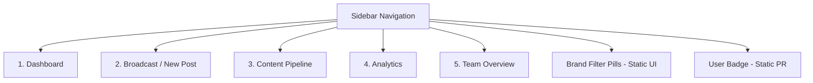
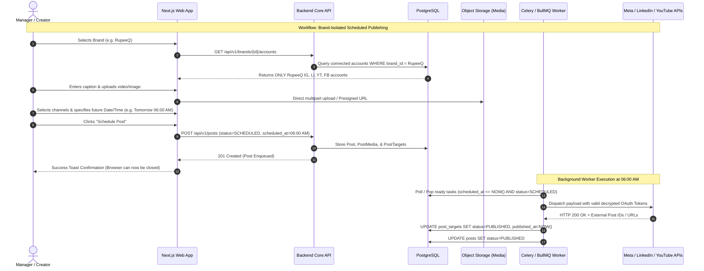
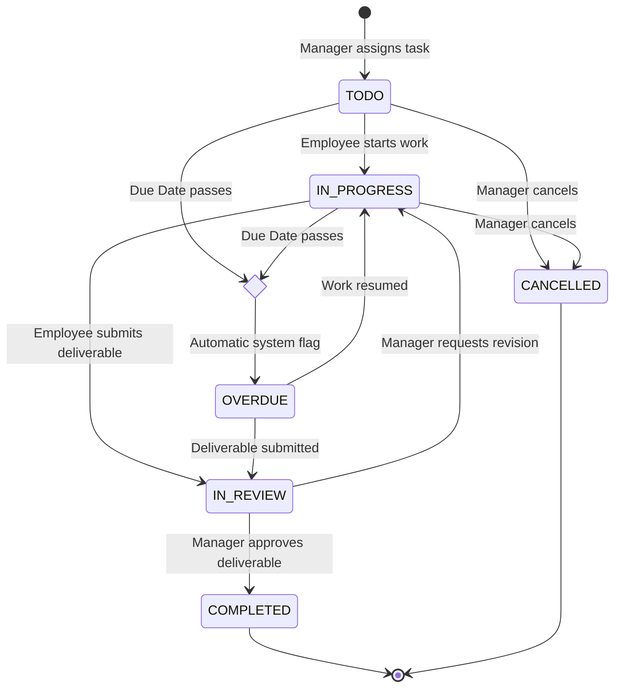
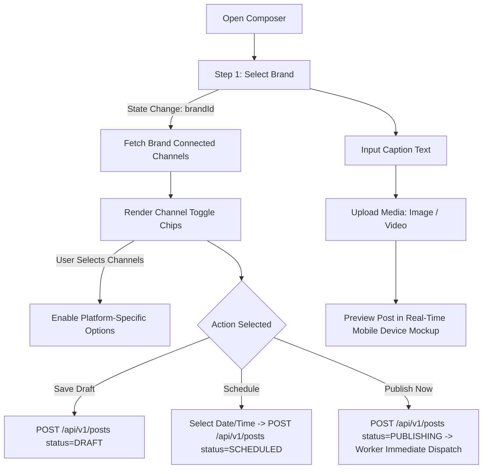
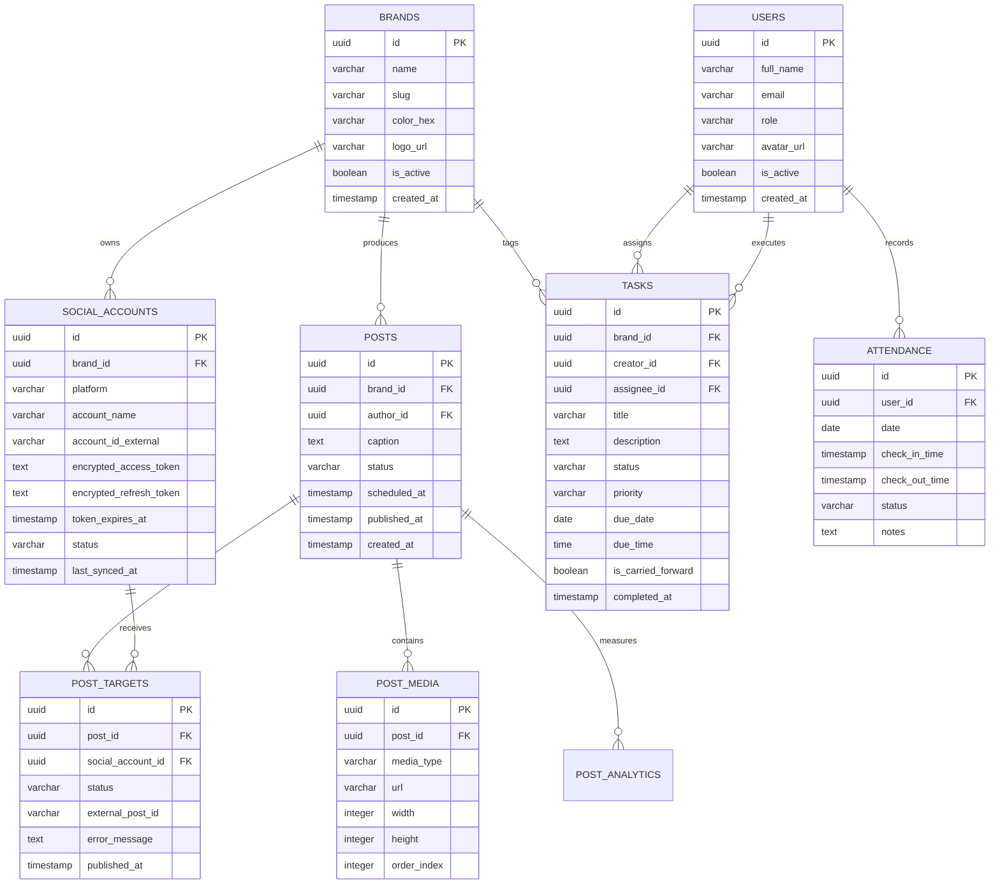

# SocialOS — Complete Prototype Analysis & Technical Specification

> **Document Version:** 1.0.0  
> **Status:** Discovery & Technical Specification  
> **Reference Prototype:** `social-crm.html` (Original Prototype)  
> **Target Architecture:** Production-Grade Multi-Brand Social Media Operations & Team Management Platform (SaaS / Enterprise Internal Operating System)

---

## 1. Prototype Overview

The reference prototype `social-crm.html` is a single-file static HTML/CSS/JavaScript document (1,303 lines, ~48.4 KB) serving as a conceptual demonstration for **SocialOS (Brand Command Center)**. 

### High-Level Summary
- **Visual Baseline:** Fixed viewport layout (`height: 100vh; overflow: hidden`) with a 220px dark sidebar and a scrollable content area.
- **Color Identity:** Dark-theme palette (`#0d0f14` base, `#161a22` surface, `#1e2330` cards, `#2a2f3e` borders) with dedicated brand accent tokens:
  - RupeeQ (`#00c48c` Emerald Green)
  - Qwikpay Matrix (`#5b8def` Electric Blue)
  - QFit (`#ff6b6b` Coral Red)
  - CodexaCraft (`#f5a623` Amber Orange)
- **External Dependencies:**
  - Google Fonts CDN: `'Inter'` (400, 500, 600) and `'Space Grotesk'` (500, 600, 700).
  - No external JavaScript libraries, UI frameworks, icon fonts, or chart libraries (icons are unicode/emojis; charts are flexbox CSS bars).
- **Core Intent:** A dual-purpose operational command center combining:
  1. Multi-brand social media content scheduling and broadcast distribution.
  2. Content pipeline lifecycle tracking (Ideas → Draft → Review → Scheduled).
  3. High-level social analytics and channel reach monitoring.
  4. Team task delegation and creative role coordination.

---

## 2. Existing Modules & Views

The prototype defines 5 primary views controlled via a single-page view switcher (`switchView()`) plus persistent sidebar controls:



### Module Breakdown

| Module / View | ID in Prototype | Core Purpose In Prototype | Current Implementation State |
| :--- | :--- | :--- | :--- |
| **Dashboard** | `#view-dashboard` | High-level metrics, recent content list, active channel status, today's schedule queue | Static HTML cards and rows; no reactive data |
| **Broadcast Post** | `#view-broadcast` | Multi-channel content composer with brand selector, caption, media placeholder, date/time picker | Simulated frontend action (`setTimeout`), no backend, no real media upload |
| **Content Pipeline** | `#view-pipeline` | Kanban board visualizing posts across 4 stages (Ideas, Draft, Review, Scheduled) | Static cards; tab filter buttons have no filtering effect; no drag-and-drop |
| **Analytics** | `#view-analytics` | Reach, engagement, post volume, platform breakdown, and top-performing posts | Hardcoded CSS progress bars, flex bar charts, and static metric numbers |
| **Team** | `#view-team` | Member profile cards showing role titles and assigned task lists | Static 2-column grid; no task assignment modal, no attendance, no history |
| **Brand Management** | Sidebar `.brand-pill` | Quick switching between 4 pre-set brands | Only toggles CSS `.active` class; does not filter any view or channel |
| **Social Accounts** | Dashboard Widget | Summarizes 13 accounts across 4 platforms | Pure text list; no connection manager, OAuth, or health indicators |

---

## 3. Deep Prototype Inspection: Elements, Interactions, & Mock Data

### 3.1 Layout & Navigation Architecture
- **Sidebar (`.sidebar`):**
  - Wordmark: "SocialOS", Tagline: "Brand Command Center".
  - Section "Main": 5 nav links (`Dashboard`, `Broadcast Post`, `Content Pipeline`, `Analytics`, `Team`).
  - Section "Brands": 4 brand pills with colored indicator dots (RupeeQ, Qwikpay Matrix, QFit, CodexaCraft).
  - Footer: User profile badge displaying initials "PR", name "Priyanshu Raj", title "Social Media Manager".
- **Topbar (`.topbar`):**
  - Dynamic text container `#page-title` updated via JS.
  - Ghost icon buttons: Bell (notifications) and Gear (settings) — non-functional placeholders.
  - Primary button `+ New Post` — invokes `switchView('broadcast', ...)` to open composer.

### 3.2 View 1: Dashboard (`#view-dashboard`)
- **Metric Cards (4x):**
  - `Total Posts (This Month)`: `84` (RupeeQ top bar, `↑ 12% vs last month`).
  - `Accounts Active`: `13` (Qwikpay top bar, `4 brands · 5 channels`).
  - `Scheduled (Pending)`: `11` (QFit top bar, `3 today · 8 this week`).
  - `Total Impressions`: `1.4L` (Codexa top bar, `↑ 34% from last month`).
- **Recent Content Feed:**
  - 6 rows with colored brand strip, post title, channel tag, relative timestamp, and status pills:
    - *RupeeQ* · "5 Free Tools Every Marketer Should Know" (IG, LI · Today 3pm) → `Scheduled` (`.s-scheduled`)
    - *CodexaCraft* · "Cloud Calling Feature Demo Reel" (YT, IG · Tomorrow) → `In Review` (`.s-review`)
    - *QFit* · "Morning Workout — 5 min no equipment" (IG Reels, YT Shorts) → `Draft` (`.s-draft`)
    - *RupeeQ* · "15 Free Digital Marketing Certifications" (LI · Yesterday) → `Live ✓` (`.s-live`)
    - *Qwikpay Matrix* · "CIBIL Score Kya Hota Hai? #LearnWithQwik" (IG, FB) → `Live ✓` (`.s-live`)
    - *QFit* · "QFit Lead Tracker — July Update" (Internal · 180 leads processed) → `Done ✓` (`.s-live`)
- **Active Channels Panel:**
  - Instagram (4 accounts), LinkedIn (4 accounts + Priyanshu Personal), YouTube (2 channels), Facebook (3 pages).
- **Today's Queue Panel:**
  - RupeeQ IG Carousel (3:00 PM · Soon)
  - Qwikpay LinkedIn (6:00 PM · Soon)
  - QFit Reels Draft (Needs approval · Red alert dot)

### 3.3 View 2: Broadcast / New Post (`#view-broadcast`)
- **Form Controls:**
  - `Brand`: Standard HTML `<select>` with 4 hardcoded options: `RupeeQ`, `Qwikpay Matrix`, `QFit`, `CodexaCraft`.
  - `Caption / Post Text`: Standard `<textarea>` with placeholder.
  - `Media Attach`: Styled `<div>` with dashed border (`border: 1.5px dashed var(--border-light)`). **Crucial finding:** There is no `<input type="file">` element inside; clicking it does nothing.
  - `Channels Select Karo`: 2-column grid containing 10 pre-rendered channel buttons:
    - RupeeQ IG, RupeeQ LI, Qwikpay IG, Qwikpay LI, QFit IG, QFit YT, CodexaCraft IG, CodexaCraft YT, RupeeQ FB, Qwikpay FB.
    - Click handler `toggleChannel(this)` toggles `.selected` class, updates tick symbol, and calculates `selected-count`.
    - **Fatal Business Flaw in Prototype:** The channel list is completely static. Changing the Brand `<select>` does **not** filter the channel grid. Users can select "RupeeQ" in the dropdown while selecting "Qwikpay Instagram" and "CodexaCraft YouTube", leading to cross-brand publishing contamination.
  - `Schedule`: Date input (`<input type="date">`) and Time input (`<input type="time" value="18:00">`).
  - `Action Buttons`:
    - `Save as Draft`: Dead button, no event handler.
    - `Preview`: Dead button, no modal or preview container.
    - `📡 Broadcast Now`: Calls `handleBroadcast()`.

### 3.4 View 3: Content Pipeline (`#view-pipeline`)
- **Tabs:** `All Brands`, `RupeeQ`, `Qwikpay`, `QFit`, `CodexaCraft`.
  - Click listener toggles visual tab underline only. Does not filter cards.
- **Kanban Columns (4 columns):**
  - **💡 Ideas (3):** QFit Summer fitness challenge, RupeeQ Overdraft vs Loan MCQ, CodexaCraft 90-day Growth Series.
  - **✍️ Draft (4):** QFit Morning Workout, Qwikpay Digital Marketing Basics, RupeeQ Credit Score Myths, CodexaCraft Cloud Calling Explainer.
  - **🔍 Review (2):** CodexaCraft Cloud Calling Demo Reel, RupeeQ 5 Free Tools.
  - **✅ Scheduled (5):** RupeeQ 5 Free Tools Final, Qwikpay CIBIL Series, QFit App Highlight, CodexaCraft Week 2 Growth, RupeeQ ACE Credit Report.
- **Card Metadata:** Brand tag, post title, channel abbreviations (IG, LI, YT, FB), scheduling/due date.
- **Limitations:** No drag-and-drop HTML5/Pointer API; no click-to-edit modal; no status progression actions.

### 3.5 View 4: Analytics (`#view-analytics`)
- **Metric Cards (4x):** Total Reach (2.3L, ↑41%), Engagement Rate (4.8%, ↑0.6%), Posts Published (84), LinkedIn Impressions (1.0L+).
- **Brand Performance Panel:** Hardcoded horizontal progress bars: RupeeQ (85k), CodexaCraft (62k), Qwikpay (48k), QFit (35k).
- **Channel Breakdown Panel:** Hardcoded horizontal progress bars: Instagram (78k), LinkedIn (65k), YouTube (42k), Facebook (28k).
- **Weekly Post Volume Panel:** 5 custom CSS bars inside `.mini-chart` (Week 1: 14 posts, Week 2: 18 posts, Week 3: 17 posts, Week 4: 26 posts, Week 5: 21 posts).
- **Top Performing Posts Panel:** 3 rows showcasing top-reach posts.

### 3.6 View 5: Team (`#view-team`)
- **4 Member Cards:**
  1. `Priyanshu Raj`: Social Media Manager · Lead (Tasks: RupeeQ content strategy, Qwikpay CIBIL approval, CodexaCraft roadmap).
  2. `Video Editor`: Video Production (Tasks: CodexaCraft Demo Reel, QFit Workout Reel, RupeeQ Intro Video).
  3. `Graphic Designer`: Creatives & Visuals (Tasks: 5 Free Tools Carousel, Qwikpay Brand Template, QFit App Banners).
  4. `Content Creator`: Copy & Content Writing (Tasks: Credit Score Myths Blog, Overdraft MCQ Series, CodexaCraft LinkedIn Week 2).
- **Limitations:** Member roles are hardcoded text. Task lists are static bullet points. There is no employee task view ("My Work"), no task status transitions, no due-date compliance tracking, no attendance system, and no manager daily review.

### 3.7 Prototype JavaScript Functions & Behavior
```javascript
// Function 1: View Switcher
function switchView(name, el) { ... } // Toggles .active on views & nav items; updates topbar title

// Function 2: Brand Pill Filter
function filterBrand(brand, el) { ... } // Visual class toggle only; 0 logic attached

// Function 3: Channel Toggle
function toggleChannel(el) { ... } // Toggles .selected; updates text counter

// Function 4: Simulated Broadcast
function handleBroadcast() {
  // Checks if selected count > 0; if 0, shows alert('Pehle koi channel select karo!')
  // Changes button to '⏳ Posting...' -> after 1800ms to '✅ Broadcast Ho Gaya!' -> resets after 2500ms
}

// Function 5: Tab underline toggle
document.querySelectorAll('.tab').forEach(...) // Toggles visual active state only
```

---

## 4. Real Business Workflows vs. Prototype Reality

The prototype establishes key conceptual intents, but diverges significantly from real production operational requirements. Below is the mapping between prototype state and production business workflows:



### A. Multi-Brand Isolation & Extensibility
- **Requirement:** SocialOS must manage multiple independent commercial brands:
  1. **RupeeQ** (Fintech / Credit Education / Personal Finance)
  2. **Qwikpay Matrix** (Payments / Merchant Services / CIBIL Education)
  3. **QFit** (Health & Fitness / Workout Routines / Mobile App)
  4. **CodexaCraft** (B2B SaaS / Developer Tools / Cloud Calling)
  5. *Future Brands:* Fully dynamic creation via Admin UI with custom branding colors, logos, and channel associations.
- **Strict Brand Isolation Rule:** Under **NO** circumstances should Brand A's assets, social channels, or content appear when authoring content for Brand B.

### B. Social Account Fleet Management
- **Target Channel Fleet:**
  - Instagram: ~4 accounts (1 per brand)
  - LinkedIn: ~4 brand pages + executive personal profiles (e.g., Priyanshu Personal)
  - YouTube: ~2 brand channels (RupeeQ, CodexaCraft)
  - Facebook: ~3 brand business pages
- **Production Standard:** Accounts must be connected via official OAuth 2.0 flows (Meta Graph API, LinkedIn Community Management API, Google YouTube Data API v3). Storing plaintext social passwords or browser cookies is strictly prohibited.

### C. Bulletproof New Post Composer Workflow
1. **Step 1 — Brand Context Selection:** User picks the active brand.
2. **Step 2 — Dynamic Channel Loading:** The UI queries the backend and displays *only* accounts bound to that brand. Cross-brand channel toggling is impossible by design.
3. **Step 3 — Content Authoring:**
   - Platform-specific caption lengths and validation (e.g., 2,200 chars for Instagram, 3,000 for LinkedIn, 100 for YouTube title + 5,000 for description).
   - Hashtag and emoji picker.
4. **Step 4 — Media Ingestion & Validation:**
   - Image/video drag-and-drop with client-side preview.
   - Aspect ratio verification (1:1 for square, 4:5 for vertical IG feed, 9:16 for Reels/Shorts, 16:9 for YouTube).
   - S3-compatible cloud object storage upload.
5. **Step 5 — Scheduling & Dispatch Mode:**
   - Date picker + Time picker (local timezone with UTC storage).
   - Options: `Save Draft`, `Submit for Review`, `Schedule`, or `Publish Immediately`.

### D. Headless Asynchronous Scheduled Publishing
- **Critical Architectural Invariant:** The user must be able to schedule a post at 11:00 PM for 06:00 AM execution and immediately close their laptop/browser.
- **Worker Execution:** A persistent background worker (e.g., Redis + Celery / BullMQ or pg-boss) evaluates due posts on a 30-second cadence, refreshes expired OAuth tokens, invokes the respective social platform APIs, handles rate limits with exponential backoff, and records delivery logs.

### E. Team LMS & Role-Based Work Distribution
- **Operational Roles:**
  - `Social Media Manager / Lead`: Creates campaigns, assigns creative tasks, approves drafts, schedules broadcasts.
  - `Video Editor`: Receives raw assets, cuts Reels/Shorts/long-form videos, uploads finished cuts for review.
  - `Graphic Designer`: Receives design briefs, designs carousels and banners, attaches design exports.
  - `Content Creator / Copywriter`: Crafts captions, hooks, hashtag sets, and educational scripts.
- **The "My Work" Invariant:** Team members should not need to message the manager on Slack/WhatsApp asking what to work on. Upon logging into SocialOS, the employee landing page displays their personal prioritized task backlog for the day.

### F. Comprehensive Task Lifecycle
The platform must implement a strict, state-machine-backed task workflow:



### G. Automatic Carry-Forward of Incomplete Tasks
- If a task is scheduled for completion on `Date D` and remains in `TODO` or `IN_PROGRESS` when the date rolls over, it must **never disappear**.
- At midnight (00:00 local time), the task is automatically flagged as `OVERDUE` / `PENDING_CARRY_FORWARD` and prominently highlighted at the top of the employee's "Today's Work" queue with an alert badge indicating days overdue.

### H. Decoupled Daily Attendance Tracking
- **Separation of Concerns:** Attendance (physical/remote work presence) must be decoupled from task completion. An employee may be present for 8 hours while working on a multi-day video project that has not yet reached `COMPLETED`.
- **Attendance States:**
  - `CHECKED_IN` (Timestamp recorded)
  - `CHECKED_OUT` (Timestamp recorded + total hours computed)
  - `PRESENT`
  - `ABSENT`
  - `HALF_DAY`
  - `ON_LEAVE`
- **History:** Permanent audit log tracking check-in time, check-out time, IP/device signature, and daily notes.

### I. Nightly Manager Command Briefing (Daily Summary)
At the end of each day (e.g., 8:00 PM), the platform generates a centralized briefing view for the Social Media Manager:
1. **Attendance Ledger:** Who checked in, who was absent, check-in times.
2. **Completed Output:** Deliverables approved today across all 4 brands.
3. **Bottlenecks / In Review:** Deliverables waiting for manager sign-off.
4. **Delinquency / Overdue:** Tasks that missed today's deadline and carried forward.
5. **Scheduled Queue:** Content slated for automatic broadcast tomorrow morning.

---

## 5. Modern Dark-First SaaS UI/UX Design System

The production interface will replace the raw, unpolished HTML prototype with an enterprise-grade dark UI inspired by platforms like Linear, Raycast, and Vercel.

### Visual Foundations

```
Surface Hierarchy:
Level 0 (App Canvas):     #090B0E (Deep Abyss)
Level 1 (Sidebar / Nav):   #0E1217 (Elevated Surface)
Level 2 (Cards / Panels):  #141922 (Card Surface)
Level 3 (Modals / Menus):  #1B222E (Floating Surface)
Level 4 (Inputs / Wells):  #0D1117 (Recessed Surface)

Borders:
Subtle:                   #212836 (1px default borders)
Active / Focus:           #3B82F6 (Primary focus ring)
Hover:                    #323D52

Typography:
Display / Headings:       Geist Sans or Plus Jakarta Sans (Semibold 600)
Body / Controls:          Inter (Regular 400, Medium 500)
Monospace (Tokens/Dates): JetBrains Mono (Regular 400)
```

### UI Component Standards
- **Layered Elevation:** Subtle 1px borders combined with micro drop-shadows (`0 1px 2px rgba(0,0,0,0.4)`).
- **Refined Status Badges:** Soft translucent backgrounds with high-contrast text and dot indicators:
  - Draft: `bg-slate-800/60 text-slate-300 border-slate-700`
  - In Review: `bg-amber-950/40 text-amber-300 border-amber-800/50`
  - Scheduled: `bg-blue-950/40 text-blue-300 border-blue-800/50`
  - Published / Live: `bg-emerald-950/40 text-emerald-300 border-emerald-800/50`
  - Overdue / Failed: `bg-rose-950/40 text-rose-300 border-rose-800/50`
- **Modern Form Elements:** Custom accessible comboboxes (Radix / Headless UI), date-time pickers with visual calendar dropdowns, character countdown meters, and drag-and-drop media upload zones with image/video preview and progress bars.
- **Feedback & Resilience:** Non-intrusive toast notifications (Sonner), explicit confirmation dialogs for destructive actions (e.g., disconnecting a social account or deleting a scheduled broadcast), skeleton loaders during fetch states, and contextual empty states with clear calls-to-action.

---

## 6. Target Dashboard Data & Static Replacement Matrix

Every static value currently embedded in `social-crm.html` must be mapped to real dynamic PostgreSQL queries and analytics aggregations.

| Prototype Element | Prototype Static Mock Value | Production Database / API Source | Aggregation Logic |
| :--- | :--- | :--- | :--- |
| Metric Card 1 | `84` Total Posts (This Month) | `posts` table | `COUNT(*) WHERE published_at >= DATE_TRUNC('month', NOW())` |
| Metric Card 1 Sub | `↑ 12% vs last month` | `posts` table | Percentage delta compared to previous calendar month window |
| Metric Card 2 | `13` Accounts Active | `social_accounts` table | `COUNT(*) WHERE is_active = true AND status = 'CONNECTED'` |
| Metric Card 2 Sub | `4 brands · 5 channels` | `brands`, `social_accounts` | `COUNT(DISTINCT brand_id)`, `COUNT(DISTINCT platform)` |
| Metric Card 3 | `11` Scheduled (Pending) | `posts` table | `COUNT(*) WHERE status = 'SCHEDULED' AND scheduled_at > NOW()` |
| Metric Card 3 Sub | `3 today · 8 this week` | `posts` table | Filtered by `scheduled_at` between today midnight and week end |
| Metric Card 4 | `1.4L` Total Impressions | `social_analytics_daily` table | `SUM(impressions) WHERE date >= DATE_TRUNC('month', NOW())` |
| Recent Content Feed | 6 hardcoded static HTML rows | `GET /api/v1/posts?limit=6&order=updated_at:desc` | Joined with `brands` and `post_targets` |
| Active Channels Panel| Static text list of 13 accounts | `GET /api/v1/social-accounts/summary` | Grouped by platform with connection health status |
| Today's Queue Panel | 3 hardcoded queue items | `GET /api/v1/posts/queue?date=today` | Ordered chronologically by `scheduled_at` |
| Brand Performance | RupeeQ 85k, Codexa 62k, etc. | `GET /api/v1/analytics/brands` | Sum of reach across accounts grouped by brand |
| Channel Breakdown | IG 78k, LI 65k, YT 42k, FB 28k | `GET /api/v1/analytics/channels` | Sum of reach grouped by platform |
| Weekly Volume Chart | 5 static CSS bars (14, 18, 17, 26, 21) | `GET /api/v1/analytics/posts-weekly` | Grouped by `DATE_TRUNC('week', published_at)` |
| Team Tasks | Hardcoded static bullets on cards | `GET /api/v1/tasks?assignee_id={id}` | Active tasks in `TODO`, `IN_PROGRESS`, `IN_REVIEW` |

---

## 7. Future Social Accounts Management UX

A dedicated **Social Accounts Settings** module must be added to provide an administrative hub for channel connections.

```
+---------------------------------------------------------------------------------------------------+
| Social Accounts Manager                                                     [+ Connect New Channel] |
| Manage official OAuth 2.0 connections across all 4 brands                                          |
+---------------------------------------------------------------------------------------------------+
| BRAND FILTER: [All Brands] [RupeeQ] [Qwikpay Matrix] [QFit] [CodexaCraft]                         |
+---------------------------------------------------------------------------------------------------+
| Account Name          Platform    Brand            Status       Health / Sync     Actions         |
|---------------------------------------------------------------------------------------------------|
| @rupeeq_official      Instagram   RupeeQ           Active       Synced 12m ago    [Refresh] [···] |
| RupeeQ Company Page   LinkedIn    RupeeQ           Active       Synced 1h ago     [Refresh] [···] |
| RupeeQ Official       YouTube     RupeeQ           Active       Synced 3h ago     [Refresh] [···] |
| RupeeQ Finance Hub    Facebook    RupeeQ           Active       Synced 30m ago    [Refresh] [···] |
| @qwikpay_matrix       Instagram   Qwikpay Matrix   Needs Reauth Expired 2d ago    [Reconnect] [···]|
| Qwikpay Corporate     LinkedIn    Qwikpay Matrix   Active       Synced 45m ago    [Refresh] [···] |
| @qfit_life            Instagram   QFit             Active       Synced 10m ago    [Refresh] [···] |
| QFit Community        Facebook    QFit             Active       Synced 2h ago     [Refresh] [···] |
+---------------------------------------------------------------------------------------------------+
```

### Security & OAuth Principles
1. **Zero Password Storage:** The system never asks for or stores usernames/passwords for Instagram, LinkedIn, YouTube, or Facebook.
2. **Encrypted Token Vault:** OAuth Access Tokens and Refresh Tokens are AES-256 encrypted at rest in PostgreSQL. Tokens are never exposed in frontend responses.
3. **Automated Health Polling:** Background worker verifies token validity every 6 hours. If a Meta long-lived token approaches its 60-day expiration, an automated warning toast and email are triggered for the admin to initiate a 1-click reauthorization.
4. **Safe Disconnect:** Disconnecting an account preserves past post history for auditing while disabling any pending scheduled broadcasts queued for that account.

---

## 8. New Post Composer UX: Brand Isolation Architecture

To completely eliminate the risk of cross-brand contamination present in `social-crm.html`, the composer follows a strict reactive state machine:



### Composer Features
- **Brand Selector Dropdown:** Visual brand pills with color dots. Switching the brand instantly unselects all active channels and resets the channel picker.
- **Brand-Gated Channel Grid:** Displays *only* connected accounts belonging to the selected brand.
- **Media Dropzone:** Supports JPEG, PNG, MP4, MOV (up to 100MB). Features drag-and-drop, upload progress indicator, thumbnail preview, and removal button.
- **Interactive Multi-Platform Previewer:** Tabbed preview pane displaying exactly how the post will render on Instagram Feed, LinkedIn Feed, and Facebook Feed.
- **Dispatch Bar:**
  - `Save Draft` (ghost button)
  - `Schedule Post` (secondary button with calendar icon)
  - `Publish Now` (primary action button with confirmation prompt)

---

## 9. Team Management & LMS Workspace UX

The team workspace is split into two specialized views based on the logged-in user's role:

### 9.1 Manager Command Console
- **Overview Metrics:** Total Team Members, Present Today, Absent Today, Open Tasks, Overdue Tasks, In Review Queue.
- **Task Dispatch Modal:**
  - Assignee selection (Social Media Manager, Video Editor, Graphic Designer, Content Creator).
  - Associated Brand (RupeeQ, Qwikpay, QFit, CodexaCraft).
  - Title, Description / Creative Brief, Reference Assets URL.
  - Priority (`LOW`, `MEDIUM`, `HIGH`, `URGENT`).
  - Strict Due Date and Due Time.
- **Live Attendance & Task Matrix:** Tabular or board view of every team member displaying check-in timestamp, current active task, completed tasks today, and overdue count.
- **Review Approval Pipeline:** Dedicated queue where the manager can inspect uploaded creatives, provide revision comments, or click `Approve & Mark Completed`.

### 9.2 Employee "My Work" Portal
- **Attendance Punch Bar:** Single-click `Check In` and `Check Out` buttons with running shift timer.
- **Prioritized Daily Task Feed:**
  1. 🚨 **Overdue / Carried Forward:** Highlighted in red with days elapsed. Must be acknowledged first.
  2. ⚡ **Due Today:** Ordered by priority (`URGENT` first).
  3. 📋 **Upcoming This Week:** Future backlog items.
- **Task Execution Drawer:** Clicking any task opens a slide-over panel where the employee updates status (`IN_PROGRESS` → `IN_REVIEW`), attaches completed media/files, or enters progress notes.

---

## 10. Database Schema & Entity Relationships

The production database schema is designed for PostgreSQL with normalized relationships, UUID primary keys, and strict foreign key constraints:



---

## 11. Backend API Endpoint Specification

All endpoints are organized in a standard RESTful convention prefixed with `/api/v1`.

### 11.1 Brand Management
- `GET /api/v1/brands` — List all active brands.
- `POST /api/v1/brands` — Create a new brand (Admin only).
- `GET /api/v1/brands/{id}` — Get single brand details.
- `PUT /api/v1/brands/{id}` — Update brand details and colors.

### 11.2 Social Accounts & OAuth
- `GET /api/v1/social-accounts` — List all accounts with filter by `brand_id` and `platform`.
- `GET /api/v1/social-accounts/connect/{platform}?brand_id={id}` — Initiate official OAuth 2.0 handshake.
- `GET /api/v1/social-accounts/callback/{platform}` — Handle OAuth redirect and securely store tokens.
- `POST /api/v1/social-accounts/{id}/refresh` — Trigger token validation and refresh.
- `DELETE /api/v1/social-accounts/{id}` — Safely disconnect social account.

### 11.3 Posts & Publishing
- `GET /api/v1/posts` — Filterable post feed (by brand, status, date range, pagination).
- `POST /api/v1/posts` — Create new post (Draft, In Review, or Scheduled).
- `GET /api/v1/posts/{id}` — Retrieve post details, media items, and target channels.
- `PUT /api/v1/posts/{id}` — Update post content or reschedule.
- `DELETE /api/v1/posts/{id}` — Delete or cancel scheduled post.
- `POST /api/v1/posts/{id}/publish-now` — Trigger immediate worker dispatch.
- `POST /api/v1/media/upload` — Get presigned S3 upload URL or upload media asset.

### 11.4 Team LMS & Tasks
- `GET /api/v1/tasks` — List tasks with filters (`assignee_id`, `brand_id`, `status`, `is_overdue`).
- `POST /api/v1/tasks` — Assign new task (Manager / Admin).
- `GET /api/v1/tasks/my-work` — Authenticated employee's personal prioritized task queue.
- `PUT /api/v1/tasks/{id}/status` — Transition task state (`TODO` → `IN_PROGRESS` → `IN_REVIEW` → `COMPLETED`).
- `PUT /api/v1/tasks/{id}` — Edit task details, priority, or deadline.

### 11.5 Attendance
- `POST /api/v1/attendance/check-in` — Record employee daily check-in.
- `POST /api/v1/attendance/check-out` — Record employee daily check-out.
- `GET /api/v1/attendance/today` — Real-time team attendance roll call for manager.
- `GET /api/v1/attendance/history` — Date-range attendance records for a specific employee.

### 11.6 Analytics & Reports
- `GET /api/v1/analytics/overview` — Dashboard summary metrics.
- `GET /api/v1/analytics/brands` — Reach and engagement aggregated per brand.
- `GET /api/v1/analytics/daily-summary?date={date}` — End-of-day managerial briefing report.

---

## 12. Role-Based Access Control (RBAC) Matrix

| Permission Key | Description | Admin | Manager | Content Creator | Graphic Designer | Video Editor |
| :--- | :--- | :---: | :---: | :---: | :---: | :---: |
| `brands:manage` | Create, update, archive brands | ✅ | ❌ | ❌ | ❌ | ❌ |
| `accounts:connect` | Connect / disconnect OAuth accounts | ✅ | ❌ | ❌ | ❌ | ❌ |
| `posts:create` | Create drafts & submit for review | ✅ | ✅ | ✅ | ✅ | ✅ |
| `posts:publish` | Directly publish or schedule broadcasts | ✅ | ✅ | ❌ | ❌ | ❌ |
| `tasks:assign` | Create & assign tasks to team members | ✅ | ✅ | ❌ | ❌ | ❌ |
| `tasks:update_own`| Update status & attach deliverables to assigned tasks | ✅ | ✅ | ✅ | ✅ | ✅ |
| `attendance:punch`| Check in and check out daily | ✅ | ✅ | ✅ | ✅ | ✅ |
| `attendance:view_all`| View team attendance roll call | ✅ | ✅ | ❌ | ❌ | ❌ |
| `analytics:view` | View engagement and reach reports | ✅ | ✅ | ✅ | ✅ | ✅ |

---

## 13. Recommended Frontend Component Architecture (Next.js App Router)

```
src/
├── app/
│   ├── (auth)/
│   │   ├── login/
│   │   └── layout.tsx
│   ├── (dashboard)/
│   │   ├── layout.tsx                  # App shell (Sidebar, Topbar, Global Modals)
│   │   ├── page.tsx                    # Command Center Dashboard
│   │   ├── broadcast/
│   │   │   └── page.tsx                # New Post / Composer View
│   │   ├── pipeline/
│   │   │   └── page.tsx                # Kanban Content Pipeline
│   │   ├── analytics/
│   │   │   └── page.tsx                # Social Analytics & Reports
│   │   ├── team/
│   │   │   ├── page.tsx                # Manager Team Overview & Attendance
│   │   │   └── my-work/
│   │   │       └── page.tsx            # Employee Personal Focused Task Workspace
│   │   └── settings/
│   │       ├── brands/
│   │       │   └── page.tsx            # Multi-Brand Configuration
│   │       └── social-accounts/
│   │           └── page.tsx            # OAuth Account Fleet Manager
│   └── api/                            # Backend API Routes / Proxy Handlers
├── components/
│   ├── ui/                             # Primitives (Button, Modal, Input, Badge, Dropdown)
│   ├── layout/                         # Sidebar, Topbar, BrandSwitcher, UserMenu
│   ├── dashboard/                      # MetricCard, RecentFeed, QueueList, ActiveChannels
│   ├── composer/                       # PostEditor, MediaDropzone, ChannelPicker, PostPreview
│   ├── pipeline/                       # KanbanBoard, KanbanColumn, KanbanCard, CardDetailModal
│   ├── team/                           # TaskTable, AttendanceWidget, AssignTaskModal, MemberCard
│   └── analytics/                      # MetricChart, BrandBarList, ChannelDonut
├── hooks/                              # useBrand, useSocialAccounts, useTasks, useAttendance
├── lib/                                # API client, formatting helpers, token handlers
└── types/                              # TypeScript interfaces for Post, Brand, Task, Attendance
```

---

## 14. Responsive & Accessibility Specifications

- **Desktop-First Command Center (>= 1280px):** Full multi-pane workflow with persistent sidebar, grid kanban, and side-by-side preview composer.
- **Tablet / Laptop (1024px - 1279px):** Collapsible icon-only sidebar (64px width); kanban transitions to horizontal scroll container with snap-points; dashboard widgets stack into 2-column layout.
- **Mobile (< 1024px):** Off-canvas slide-out navigation sheet; bottom navigation bar for quick access (`Dashboard`, `New Post`, `My Work`); single-column card feeds; full-screen composer modal.
- **Keyboard Shortcuts & Accessibility:**
  - `Cmd/Ctrl + K`: Global quick search / command palette.
  - `C`: Open New Post composer from anywhere.
  - `Escape`: Close modals and slide-overs.
  - Strict semantic HTML tags (`<main>`, `<aside>`, `<nav>`, `<header>`) with ARIA labels on all icon buttons.

---

## 15. Key Architectural Decisions & Open Questions

Before proceeding to implementation, the following foundational decisions should be confirmed:

1. **Full-Stack Stack Selection:**
   - *Option A:* Unified Full-Stack Next.js 15 (App Router, Server Actions / Route Handlers, Prisma/Drizzle ORM, NextAuth/Auth.js) + Redis/BullMQ background worker.
   - *Option B:* Decoupled Architecture with Next.js 15 frontend + Python FastAPI / Celery backend + SQLAlchemy ORM.
2. **Media Storage Backend:**
   - Use AWS S3, Cloudflare R2, or local minio for staging media assets before publishing to social APIs.
3. **Scheduled Dispatch Engine:**
   - Redis-backed BullMQ worker vs. PostgreSQL-native queue (pg-boss) vs. Celery Beat scheduler.
4. **Mock vs. Live OAuth Strategy for Development:**
   - Implement an automated Mock Social Platform Provider mode to allow full end-to-end composer and publishing simulation without requiring live production Facebook/LinkedIn developer app verification immediately.
