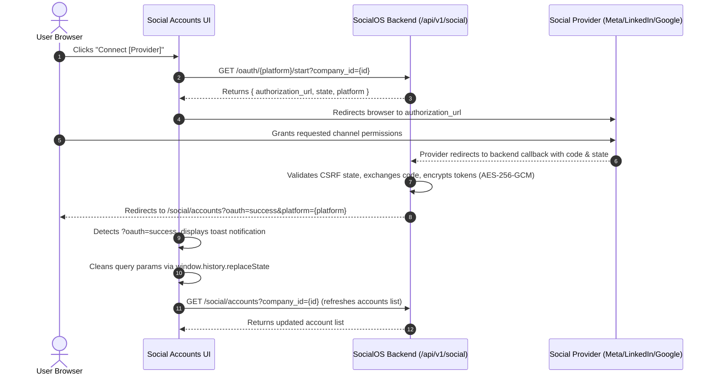

# SocialOS Social Accounts Management UI

## 1. Overview

The Social Accounts management interface provides a centralized, modern SaaS dashboard for connecting, viewing, refreshing, and disconnecting external social media channels (Instagram, Facebook, LinkedIn, YouTube) scoped to specific brand workspaces.

- **Route**: [`/social/accounts`](file:///Users/roushan_iiitbgp/Desktop/SocailOS/frontend/src/app/social/accounts/page.tsx)
- **Component Architecture**: Modular React 19 client components styled with Tailwind CSS in dark-first theme.

---

## 2. Company & Brand Isolation UX

Social media channels are strictly company-scoped:
- **Active Brand Selector**: The top bar displays an active brand workspace dropdown (`CompanySelector`).
- **Dynamic Reloading**: Switching the active brand immediately queries `/api/v1/social/accounts?company_id=<id>` for that specific company and updates the account list. Accounts from different companies are never mixed.
- **Role-Based Visibility**:
  - Non-admin users can only view and select brand workspaces where they have active `CompanyMembership`.
  - System administrators (`ADMIN`) can switch across all workspaces.
  - **Authoritative Security**: The backend remains the sole authority; attempts to query unauthorized company IDs return `403 Forbidden` and render a clear error state with retry.

---

## 3. Supported Providers

| Platform | Capabilities | Auth Protocol |
| :--- | :--- | :--- |
| **Instagram** | Photo & Carousel Posts, Reels, Audience Analytics | OAuth 2.0 (Instagram Basic Display / Graph API) |
| **Facebook** | Page Feed Posts, Video, Community Engagement | OAuth 2.0 (Meta Graph API v19.0) |
| **LinkedIn** | Company Page Updates, Articles, B2B Insights | OAuth 2.0 (OpenID Connect v2 & Member Social) |
| **YouTube** | Shorts, Video Publications, Channel Metrics | Google OAuth 2.0 (YouTube Data API v3) |

---

## 4. OAuth Handshake Flow (Frontend Perspective)



---

## 5. Safe Data Handling & Zero-Leakage Policy

The frontend receives **only safe account metadata** matching [`SocialAccount`](file:///Users/roushan_iiitbgp/Desktop/SocailOS/frontend/src/types/social.ts):

```typescript
export interface SocialAccount {
  id: string;
  company_id: string;
  platform: "INSTAGRAM" | "FACEBOOK" | "LINKEDIN" | "YOUTUBE";
  account_name: string;
  platform_account_id: string;
  status: "ACTIVE" | "DISCONNECTED" | "EXPIRED" | "ERROR";
  token_expires_at: string | null;
  last_connected_at: string | null;
  created_at: string;
  updated_at: string;
}
```

- **Zero Secrets Policy**: The frontend never receives, displays, or stores `access_token`, `refresh_token`, `client_secret`, or authorization codes.
- No tokens exist in `localStorage`, `sessionStorage`, cookies, React state, or URLs.

---

## 6. Disconnect & Refresh UX

### Disconnect Flow
1. Clicking **Disconnect** triggers a confirmation dialog ([`DisconnectAccountDialog`](file:///Users/roushan_iiitbgp/Desktop/SocailOS/frontend/src/components/social/DisconnectAccountDialog.tsx)).
2. The modal explains: *"Scheduled publishing for this account may stop working once disconnected."*
3. On confirmation, issues `DELETE /api/v1/social/accounts/{social_account_id}`.
4. On success: clears the modal, refetches the active brand's accounts, and displays a success toast.
5. On failure: displays an error alert with actionable feedback.

### Refresh Connection Flow
1. Clicking **Refresh** on any account card issues `POST /api/v1/social/accounts/{social_account_id}/refresh`.
2. The card shows a loading indicator while the backend communicates with the external provider.
3. On success: updates the account status, updates `last_connected_at`, and displays a toast notification.
4. On failure: alerts the user if external credentials have expired, prompting reconnection.

---

## 7. UI States

- **Loading State**: [`AccountSkeleton`](file:///Users/roushan_iiitbgp/Desktop/SocailOS/frontend/src/components/social/AccountSkeleton.tsx) displays pulse shimmer placeholders.
- **Empty State**: [`AccountEmptyState`](file:///Users/roushan_iiitbgp/Desktop/SocailOS/frontend/src/components/social/AccountEmptyState.tsx) provides a branded call-to-action when no accounts are connected.
- **Error State**: [`AccountErrorState`](file:///Users/roushan_iiitbgp/Desktop/SocailOS/frontend/src/components/social/AccountErrorState.tsx) provides human-readable errors with a one-click Retry button.
- **Toast Notifications**: [`OAuthToastBanner`](file:///Users/roushan_iiitbgp/Desktop/SocailOS/frontend/src/components/social/OAuthToastBanner.tsx) handles feedback for OAuth callbacks, disconnects, and refreshes.
