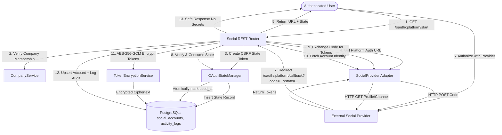

# SocialOS Social OAuth & Account Connections Architecture

## 1. Executive Summary

The SocialOS Social OAuth foundation provides a production-grade, modular, and secure backend subsystem for connecting company workspaces (brands) to external social media platforms.

Supported platforms in Step 9:
1. **Instagram** (Instagram Graph API / Basic Display OAuth 2.0)
2. **Facebook** (Meta Graph API OAuth 2.0 with Long-Lived Token Exchange)
3. **LinkedIn** (OAuth 2.0 / OpenID Connect v2 & Member Social)
4. **YouTube** (Google Identity OAuth 2.0 with offline refresh tokens & YouTube Data API v3)

---

## 2. Architectural Design



---

## 3. Pluggable Social Provider Adapter Pattern

All platform integrations adhere to the abstract contract defined in [`SocialProvider`](file:///Users/roushan_iiitbgp/Desktop/SocailOS/backend/app/services/social/base.py):

```python
class SocialProvider(ABC):
    platform: Platform

    @abstractmethod
    def get_authorization_url(self, state: str, redirect_uri: Optional[str] = None) -> str:
        """Constructs platform authorization URL with client_id, scopes, and CSRF state."""
        ...

    @abstractmethod
    async def exchange_code_for_tokens(self, code: str, redirect_uri: Optional[str] = None) -> OAuthTokenResult:
        """Exchanges authorization code for access and refresh tokens."""
        ...

    @abstractmethod
    async def refresh_tokens(self, refresh_token: str) -> OAuthTokenResult:
        """Exchanges refresh token or long-lived token with platform."""
        ...

    @abstractmethod
    async def get_account_identity(self, access_token: str) -> SocialAccountIdentity:
        """Retrieves normalized account identity (id, handle, avatar)."""
        ...
```

### Factory & Registry
A centralized registry pattern ([`get_social_provider`](file:///Users/roushan_iiitbgp/Desktop/SocailOS/backend/app/services/social/__init__.py)) instantiates adapters based on the requested `Platform` enum. This decouples business logic and REST endpoints from platform-specific SDKs and APIs.

---

## 4. Security & Cryptographic Invariants

### 4.1. AES-256-GCM Token Encryption at Rest
- Sensitive tokens (`access_token`, `refresh_token`) are **NEVER stored in plaintext**.
- The database schema strictly defines `encrypted_access_token` and `encrypted_refresh_token` as columns on the `social_accounts` table.
- Encryption uses Authenticated Encryption with Associated Data (AEAD) via NIST SP 800-38D compliant **AES-256-GCM** ([`TokenEncryptionService`](file:///Users/roushan_iiitbgp/Desktop/SocailOS/backend/app/services/encryption_service.py)).
- A fresh, cryptographically secure 12-byte random nonce (`os.urandom(12)`) is generated per encryption operation.
- Ciphertext serialization format: `v1:<base64url(nonce + ciphertext + 16-byte-auth-tag)>`.
- Decryption validates tag authenticity; any tampering raises `TokenDecryptionError`.
- **Zero Plaintext Leakage**: Error messages, logs, and tracebacks are scrubbed to ensure plaintext tokens or cryptographic keys are never leaked.

### 4.2. Cryptographic CSRF State Protection
- The OAuth flow generates an unpredictable 48-byte URL-safe random string (`secrets.token_urlsafe(48)`).
- State tokens are bound to:
  1. `user_id` (initiating user session)
  2. `company_id` (target brand workspace)
  3. `platform` (destination social network)
  4. `expires_at` (10-minute default TTL)
- **Single-Use Invalidation**: Consuming a state token immediately marks `used_at = now()`. Any replay attack with the same state parameter is rejected with `400 Bad Request`.

### 4.3. Company & Brand Isolation
- Operations on social accounts (`start`, `accounts`, `disconnect`, `refresh`) strictly require active membership in the target company workspace.
- Cross-company access attempts return `403 Forbidden`.
- System administrators (`ADMIN` role) retain global oversight across all brand workspaces.

### 4.4. Response Sanitization
The public Pydantic schema [`SocialAccountRead`](file:///Users/roushan_iiitbgp/Desktop/SocailOS/backend/app/schemas/social.py) explicitly omits token fields. Provider credentials are never transmitted over API responses to the frontend or clients.

---

## 5. REST API Reference

All endpoints are mounted under `/api/v1/social`:

| Method | Endpoint | Description | Auth Required |
| :--- | :--- | :--- | :--- |
| `GET` | `/api/v1/social/accounts?company_id=<uuid>` | List connected social accounts for authorized company | Yes (Member / Admin) |
| `GET` | `/api/v1/social/oauth/{platform}/start?company_id=<uuid>` | Generate authorization URL and CSRF state token | Yes (Member / Admin) |
| `GET` | `/api/v1/social/oauth/{platform}/callback` | Handle redirect callback, exchange code, encrypt tokens | Browser / OAuth Redirect |
| `DELETE` | `/api/v1/social/accounts/{social_account_id}` | Disconnect account and clear encrypted credentials | Yes (Member / Admin) |
| `POST` | `/api/v1/social/accounts/{social_account_id}/refresh` | Refresh expired credentials using encrypted refresh token | Yes (Member / Admin) |

---

## 6. Audit Logging

All security-sensitive operations record immutable entries in [`activity_logs`](file:///Users/roushan_iiitbgp/Desktop/SocailOS/backend/app/models/activity_log.py):

| Action | Entity Type | Metadata Logged |
| :--- | :--- | :--- |
| `OAUTH_CONNECTION_STARTED` | `social_account` | `{"company_id": "...", "platform": "..."}` |
| `OAUTH_CONNECTION_FAILED` | `social_account` | `{"company_id": "...", "platform": "...", "stage": "..."}` |
| `SOCIAL_ACCOUNT_CONNECTED` | `social_account` | `{"company_id": "...", "platform": "...", "account_name": "...", "platform_account_id": "..."}` |
| `SOCIAL_ACCOUNT_DISCONNECTED` | `social_account` | `{"company_id": "...", "platform": "...", "account_name": "..."}` |
| `TOKEN_REFRESH_SUCCEEDED` | `social_account` | `{"company_id": "...", "platform": "..."}` |
| `TOKEN_REFRESH_FAILED` | `social_account` | `{"company_id": "...", "platform": "..."}` |

---

## 7. Migration Summary

- **Revision**: `0004_add_social_oauth_foundation`
- **Target Database**: Live Supabase PostgreSQL
- **Schema Updates**:
  - Created table `oauth_states` with indexes on `state_token`, `user_id`, `company_id`, and `platform`.
  - Added column `last_connected_at` (timestamptz, nullable) to `social_accounts`.
  - Reused existing `platform_enum` (`INSTAGRAM`, `FACEBOOK`, `LINKEDIN`, `YOUTUBE`).
